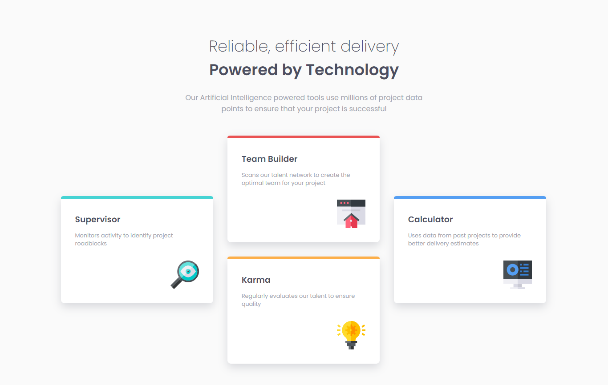
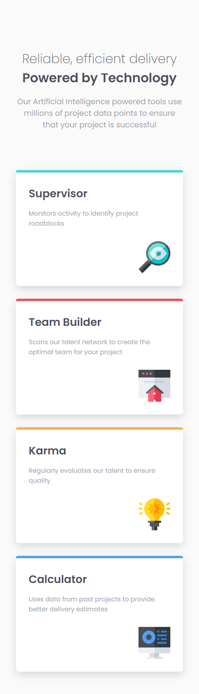

# Frontend Mentor - Four card feature section solution

This is a solution to the [Four card feature section challenge on Frontend Mentor](https://www.frontendmentor.io/challenges/four-card-feature-section-weK1eFYK).

## Table of contents

- [Overview](#overview)
  - [Screenshot](#screenshot)
  - [Links](#links)
- [My process](#my-process)
  - [Built with](#built-with)
  - [What I learned](#what-i-learned)
  - [Useful resources](#useful-resources)
- [Author](#author)

## Overview

### The challenge

Users should be able to:

- View the optimal layout for the site depending on their device's screen size

### Screenshot




### Links

- Solution URL: [Github repo](https://github.com/b16h22/four_card_feature_section_solution)
- Live Site URL: [Github pages](https://b16h22.github.io/four_card_feature_section_solution/)

## My process

### Built with

- Semantic HTML5 markup
- CSS custom properties
- Flexbox
- CSS Grid

### What I learned

I was able to dig into the CSS Grid layout and it's amazing capabilities in this challenge. I was able to create a virtual grid system and place the child components in preferred positions without much effort. It also helped me create a mobile sceen friendly layout solution with very minimal changes to the CSS code.

```css
    .content {
      display: grid;
      grid-template-columns: 21em 21em 21em;
      grid-template-rows: auto auto auto auto;
      gap: 2em;
      padding: 2em;
      max-height: 100%;
      max-width: 71em;
    }
```
```css
    .card1 {
      grid-row: 2 / span 2;
    }

    .card2 {
      grid-row: 1 / span 2;
    }

    .card3 {
      grid-row: 3 / span 2;
    }

    .card4 {
      grid-row: 2 / span 2;
    }
```

### Useful resources

- [CSS Flexbox](https://www.w3schools.com/css/css3_flexbox.asp) - This is a good article that helped me understand CSS Flexbox and it's capabilities.
- [CSS Grid](https://www.w3schools.com/CSS/css_grid.asp) - This is a detailed article that helped me understand CSS Grid layout and it's possibilities.

## Author

- Frontend Mentor - [@b16h22](https://www.frontendmentor.io/profile/b16h22)
